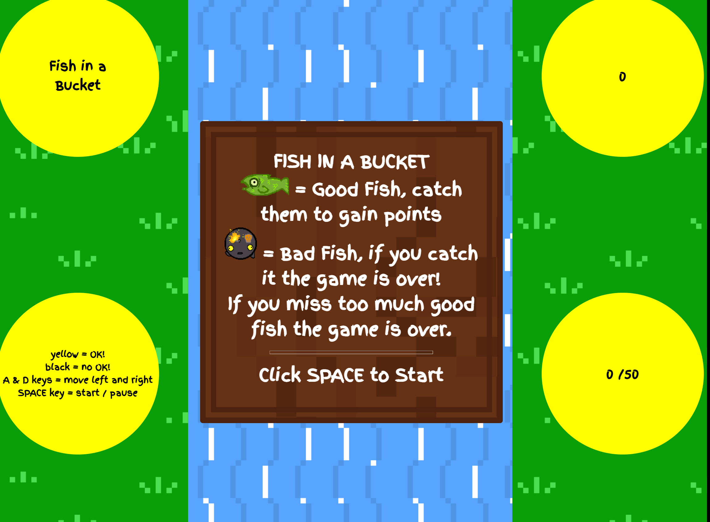
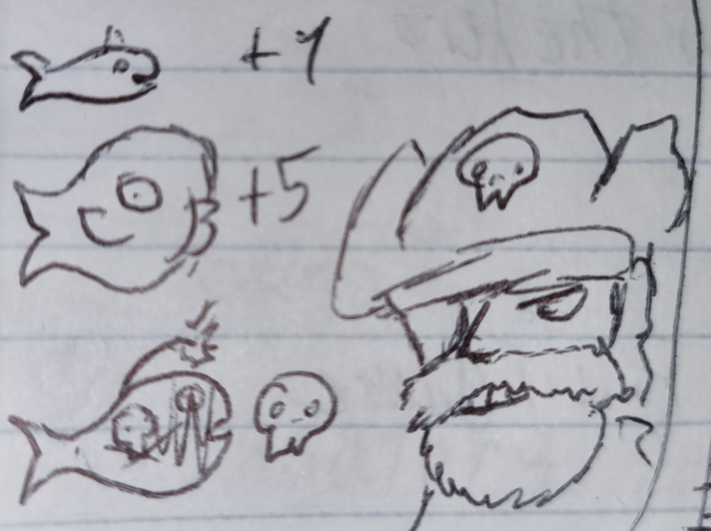
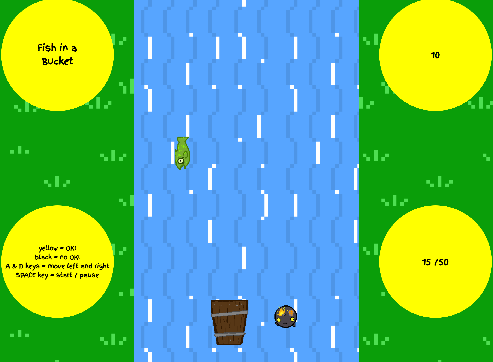
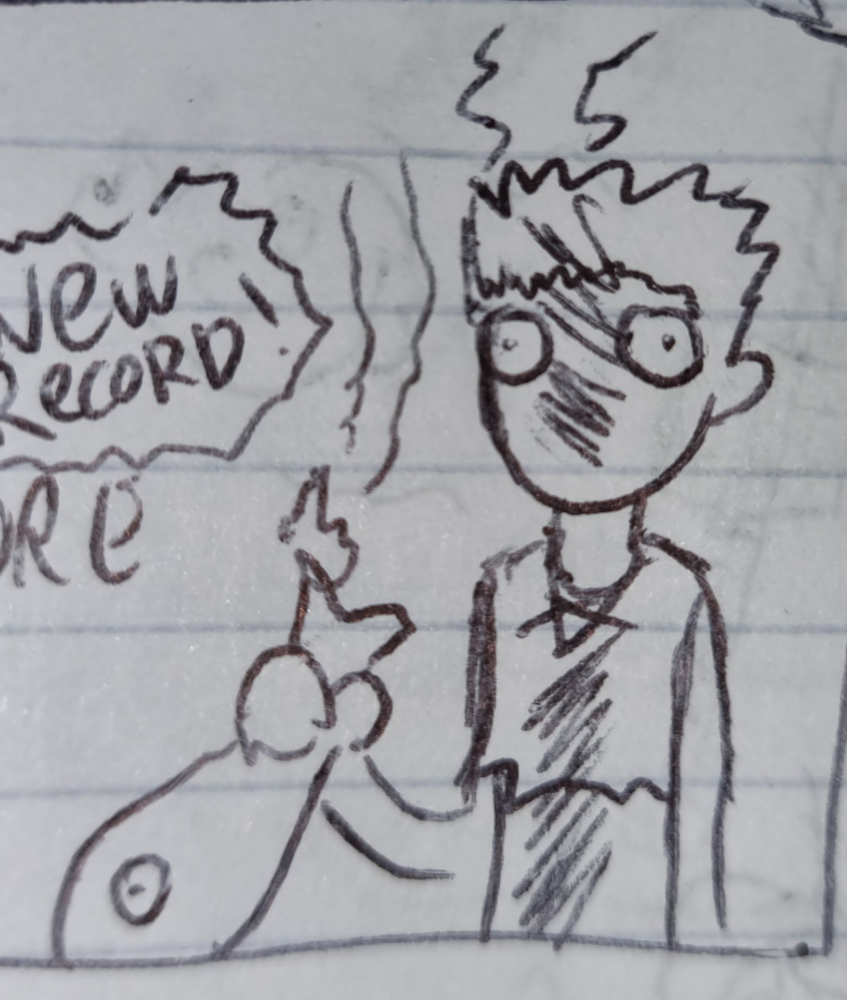
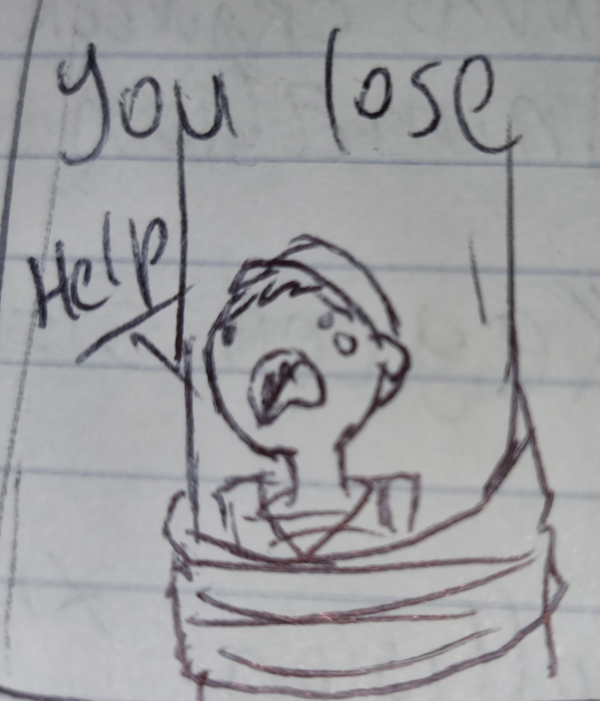
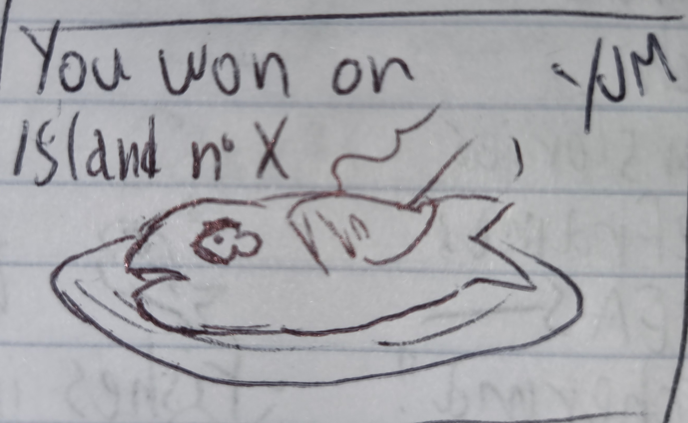

# Fish in a Bucket

## Overview
Here's the story: 
You are a cook on a pirate ship which stopped on an island full of treasures. Your ship is about to leave when the captain tells you that there is 
no food on board and the crew is hungry. Luckily there is a river near you so before you set sail
you stop there and try go fishing for some food. All you have is a bucket and a rope but you manage to find a clever way to feed your crew.
The river has three kinds of fishes:
1. Blue Anchovies, they're small and weight around 4 oz.
2. Green Salmons, they're longer and weight around 20 oz.
3. Golden Catfish, the largest fresh water fish around, very fat and very rare, they weight around 100 oz.
4. FuseFin Trout, a weird species of fish, black and round, when they're not in the water the fuse on their heads lights on and that causes a big explosion. Don't pick up those guys or you will lose all your progress

Every man of your crew is gonna need at least 20 oz. of fish to feed themselves and on this trip the crew has 10 people.
Although this is only the first trip. The island has a lot of booty to transport, you'll have to come back to get it and on every trip the crew is gonna get bigger and bigger.
That means: more mouths to feed and more fish to catch with your bucket.
And another thing: when you are fishing the captain is watching and if you miss too many pounds of fish he may punish you...
Good luck!

## Technologies Used
1. HTML5
2. CSS
3. JavaScript
4. Canvas
5. Digital Art Program

## User Stories
- As a user, I want to keep my high score
- As a user, I want to share my result on my social media
- As a user, I want a hi-score mode

## Wireframes and screenshots
1. This is the home screen, from there the user can start the game or read the instructions.
  
2. In the instructions the captain will explain to the user the various types of fishes to catch, the winning and the losing conditions.
  
3. The gameplay is very simple, the bucket moves right and left while the fishes come towards you, your objective is catch the good ones and avoid the fishbombs. 
4. If you pick up a fishbomb you make the ship explode and the game over screen will pop up. 
5. If you miss to many fishes the captain will tie you to the mast of the ship and it will be game over as well. 
6. Although if you manage to catch enough fishes for your crew you will win the level. he next one will have a larger crew so it will require more fish to be caught. 

GO AND MAKE YOUR CAPTAIN PROUD!

